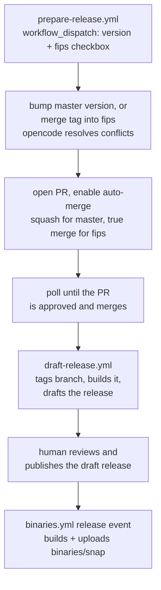

# Hacking on Pebble

- [Running the daemon](#running-the-daemon)
- [Using the CLI client](#using-the-cli-client)
- [Using Curl to hit the API](#using-curl-to-hit-the-api)
- [Code style](#code-style)
- [Running the tests](#running-the-tests)
- [Docs](#docs)
- [Creating a release](#creating-a-release)

Hacking on Pebble is easy. It's written in Go, so install or [download](https://golang.org/dl/) a copy of the latest version of Go. Pebble uses [Go modules](https://golang.org/ref/mod) for managing dependencies, so all of the standard Go tooling just works.

To compile and run Pebble, use the `go run` command on the `cmd/pebble` directory. The first time you run it, it will download dependencies and build packages, so will take a few seconds (but after that be very fast):

```
$ go run ./cmd/pebble
Pebble lets you control services and perform management actions on
the system that is running them.

Usage: pebble <command> [<options>...]
...
```

If you want to build and install the executable to your `~/go/bin` directory (which you may want to add to your path), use `go install`:

```
go install ./cmd/pebble
```

However, during development it's easiest just to use `go run`, as that will automatically recompile if you've made any changes.


## Running the daemon

To run the Pebble daemon, set the `$PEBBLE` environment variable and use the `pebble run` sub-command, something like this:

```
$ mkdir ~/pebble
$ export PEBBLE=~/pebble
$ go run ./cmd/pebble run
2021-09-15T01:37:23.962Z [pebble] Started daemon.
...
```


## Using the CLI client

The use the Pebble command line client, run one of the other Pebble sub-commands, such as `pebble plan` or `pebble services` (if the server is running in one terminal, do this in another):

```
$ export PEBBLE=~/pebble
$ go run ./cmd/pebble plan
services:
    snappass:
        override: replace
        command: sleep 60

$ go run ./cmd/pebble services
Service   Startup   Current
snappass  disabled  inactive
```


## Using Curl to hit the API

For debugging, you can also use [curl](https://curl.se/) in unix socket mode to hit the Pebble API:

```
$ curl --unix-socket ~/pebble/.pebble.socket 'http://localhost/v1/services?names=snappass' | jq
  % Total    % Received % Xferd  Average Speed   Time    Time     Time  Current
                                 Dload  Upload   Total   Spent    Left  Speed
100   120  100   120    0     0   117k      0 --:--:-- --:--:-- --:--:--  117k
{
  "type": "sync",
  "status-code": 200,
  "status": "OK",
  "result": [
    {
      "name": "snappass",
      "startup": "disabled",
      "current": "inactive"
    }
  ]
}
```


## Code style

### Commits

Please format your commits following the [conventional commit](https://www.conventionalcommits.org/en/v1.0.0/#summary) style.

Optionally, use the brackets to scope to a particular component where applicable.

See below for some examples of commit headings:

```
feat: checks inherit context from services
test: increase unit test stability
feat(daemon): foo the bar correctly in the baz
test(daemon): ensure the foo bars correctly in the baz
ci(snap): upload the snap artefacts to Github
chore(deps): update go.mod dependencies
```

Recommended prefixes are: `fix:`, `feat:`, `build:`, `chore:`, `ci:`, `docs:`, `style:`, `refactor:`,`perf:` and `test:`

### Imports

Pebble imports should be arranged in three groups:

- standard library imports
- third-party / non-Pebble imports
- Pebble imports (i.e. those prefixed with `github.com/canonical/pebble`)

Imports should be sorted alphabetically within each group.

We use the [`gopkg.in/check.v1`](https://pkg.go.dev/gopkg.in/check.v1) package for testing. Inside a test file, import this as follows:

```go
. "gopkg.in/check.v1"
```

so that identifiers from that package will be added to the local namespace.


Here is an example of correctly arranged imports:

```go
import (
	"fmt"
	"net"
	"os"

	"github.com/gorilla/mux"
	. "gopkg.in/check.v1"

	"github.com/canonical/pebble/internals/systemd"
	"github.com/canonical/pebble/internals/testutil"
)
```

### Log and error messages

**Log messages** (that is, those passed to `logger.Noticef` or `logger.Debugf`) should begin with a capital letter, and use "Cannot X" rather than "Error Xing":

```go
logger.Noticef("Cannot marshal logs to JSON: %v", err)
```

**Error messages** should be lowercase, and again use "cannot ..." instead of "error ...":

```go
fmt.Errorf("cannot create log client: %w", err)
```


## Running the tests

Pebble has a suite of Go unit tests, which you can run using the regular `go test` command. To test all packages in the Pebble repository:

```
$ go test ./...
ok      github.com/canonical/pebble/client  (cached)
?       github.com/canonical/pebble/cmd [no test files]
ok      github.com/canonical/pebble/cmd/pebble  0.095s
...
```

To test a single package, simply pass the package path to `go test`:

```
$ go test ./cmd/pebble
ok      github.com/canonical/pebble/cmd/pebble  0.115s
```

To run a single suite or a single test, pass the suite or test name to the [gocheck](https://labix.org/gocheck) test runner:

```
$ go test ./cmd/pebble -v -check.v -check.f PebbleSuite
=== RUN   Test
PASS: cmd_add_test.go:38: PebbleSuite.TestAdd   0.002s
PASS: format_test.go:52: PebbleSuite.TestCanUnicode 0.000s
...
PASS: cmd_version_test.go:26: PebbleSuite.TestVersionCommand    0.000s
OK: 20 passed
--- PASS: Test (0.02s)
PASS
ok      github.com/canonical/pebble/cmd/pebble  0.022s

$ go test ./cmd/pebble -v -check.v -check.f PebbleSuite.TestAdd
=== RUN   Test
PASS: cmd_add_test.go:38: PebbleSuite.TestAdd   0.002s
OK: 1 passed
--- PASS: Test (0.00s)
PASS
ok      github.com/canonical/pebble/cmd/pebble  0.007s
```

Note that during CI we run the tests with `-race` to catch data races:

```
$ go test -race ./...
ok      github.com/canonical/pebble/client  (cached)
?       github.com/canonical/pebble/cmd [no test files]
ok      github.com/canonical/pebble/cmd/pebble  0.165s
...
```

Pebble also has a suite of integration tests for testing things like `pebble run`. To run them, use the "integration" build constraint:

```
$ go test -count=1 -tags=integration ./tests/
ok  	github.com/canonical/pebble/tests	4.774s
```

## Docs

We use [`sphinx`](https://www.sphinx-doc.org/en/master/) to build the docs with styles preconfigured by the [Canonical Documentation Starter Pack](https://github.com/canonical/sphinx-docs-starter-pack).

### Building the Docs

To build the docs, run `make run` in the `docs` directory.

### Pulling in the Latest Style Changes and Dependencies

To update the documentation starter pack, run `make update` in the `docs` directory.

### Updating the CLI reference documentation

To add a new CLI command, ensure that it is added in the list at the top of the [doc](docs/reference/cli-commands.md) in the appropriate section, and then add a new section for the details **in alphabetical order**.

The section should look like:

````
(reference_pebble_{command name}_command)=
## {command name}

The `{command name}` command is used to {describe the command}.

<!-- START AUTOMATED OUTPUT FOR {command name} -->
```{terminal}
pebble {command name} --help
```
<!-- END AUTOMATED OUTPUT FOR {command name} -->
````

With `{command name}` replaced by the name of the command and `{describe the command}` replaced by a suitable description.

To automatically update the CLI reference documentation, run `make cli-help` in the `docs` directory.

A CI workflow will fail if the CLI reference documentation does not match the actual output from Pebble.

Note that the [OpenAPI spec](docs/specs/openapi.yaml) also needs to be manually updated.

### Writing a great doc

- Use short sentences, ideally with one or two clauses.
- Use headings to split the doc into sections. Make sure that the purpose of each section is clear from its heading.
- Avoid a long introduction. Assume that the reader is only going to scan the first paragraph and the headings.
- Avoid background context unless it's essential for the reader to understand.

Recommended tone:

- Use a casual tone, but avoid idioms. Common contractions such as "it's" and "doesn't" are great.
- Use "we" to include the reader in what you're explaining.
- Avoid passive descriptions. If you expect the reader to do something, give a direct instruction.

## Creating a release

When releasing, you need to release the `master` branch and the `fips` branch. Most of this is automated by a chain of GitHub Actions; see below for what's automated and what's still manual.

Binaries will be created and uploaded automatically to this release by the [binaries.yml](https://github.com/canonical/pebble/blob/master/.github/workflows/binaries.yml) GitHub Action. In addition, a new Snap version is built and uploaded to the [Snap Store](https://snapcraft.io/pebble) (but promotion to `stable` is a manual step).

### Automation overview



`prepare-release.yml` is a single manually-triggered workflow that handles both the master release and the FIPS release, controlled by its `fips` checkbox input:

- **Non-FIPS** (`fips` unchecked): bumps `Version` in `cmd/version.go` on `master`.
- **FIPS** (`fips` checked): merges the tag of the version you give it -- which must already be a published non-FIPS release -- into the `fips` branch, using [opencode](https://opencode.ai) to resolve any conflicts (by dropping TLS/crypto usages from the merged code), then bumps `Version` to the `-fips` suffixed version.

Either way, it then opens a pull request (squash auto-merge for master, true-merge auto-merge for fips, to preserve fips branch history) and **polls until that PR merges** before continuing -- there's no need to re-run or babysit multiple workflows. Once merged, it calls the reusable `draft-release.yml` workflow, which tags the tip of the branch, builds it as a sanity check, and drafts a GitHub release with a title/notes generated by opencode (using previous releases of the same kind -- FIPS or non-FIPS -- as style examples).

The workflow never publishes the release itself -- that, along with monitoring the resulting binaries/snap workflows and promoting the snap, remains a manual step below.

These workflows require some one-off repository configuration; see the comments at the top of [`prepare-release.yml`](https://github.com/canonical/pebble/blob/master/.github/workflows/prepare-release.yml) and [`draft-release.yml`](https://github.com/canonical/pebble/blob/master/.github/workflows/draft-release.yml) for the required `OPENROUTER_API_KEY` secret and branch protection settings.

`prepare-release.yml` uses the default `GITHUB_TOKEN` (rather than a separate bot account/PAT) to keep secret management simple. The trade-off is that GitHub does not run other workflows (like Tests or Lint) off of pull requests/branches/pushes made with the default `GITHUB_TOKEN`, to prevent recursive workflow runs. So the pull request it opens won't automatically get CI status checks -- only the approving review is enforced automatically. If you want CI to gate the merge too, either configure a bot token/GitHub App for this workflow instead (see the comments in the file for exactly which steps to change), or have a maintainer manually trigger the checks (e.g. push an empty commit, or close and reopen the PR) before approving.

Because the workflow polls for the PR to merge rather than reacting to an event, the run is subject to the 6-hour maximum job runtime GitHub enforces for GitHub-hosted runners. If review takes longer than that, re-run the workflow with the same inputs once the branch/PR already exists.

### Main release (master branch)

- Go to [Actions -> Prepare release](https://github.com/canonical/pebble/actions/workflows/prepare-release.yml), leave the `fips` checkbox unchecked, and run the workflow with the version you're about to publish, for example `v1.27.0`.
- Review and approve the resulting version bump pull request (and manually confirm CI has passed, per the note above). The workflow detects the merge, tags `master`, builds it, and drafts a release.
- Open the [draft release](https://github.com/canonical/pebble/releases), review/edit the generated title and notes, and click "Publish release".
- Monitor the release [GitHub Actions](https://github.com/canonical/pebble/actions) and check that the [snap](https://snapcraft.io/pebble) is uploaded correctly.
- If you're confident it's a compatible release, [promote the `candidate` snap to `stable`](https://snapcraft.io/pebble/releases).
- Find the security scan artifact on the corresponding [SBOM and secscan](https://github.com/canonical/pebble/actions/workflows/sbom-secscan.yaml) run, and upload it to the [SSDLC Pebble folder in Drive](https://drive.google.com/drive/folders/11WR629JFPJ8IMPI0kcsNp_qdf39c6no3). Open the artifact and verify that the security scan has not found any vulnerabilities.

### FIPS release (fips branch)

- Once the master release above has been published, go to [Actions -> Prepare release](https://github.com/canonical/pebble/actions/workflows/prepare-release.yml) again, this time entering the same version tag (for example `v1.27.0`) and checking the `fips` checkbox.
- Review and approve the resulting pull request merging that tag into `fips` (with conflicts pre-resolved by opencode). Review it carefully, especially any TLS/crypto-related conflict resolutions (and manually confirm CI has passed, per the note above). **Important:** it merges using a true merge commit, rather than a squash-and-merge commit -- this is automatic, just don't override it.
- The workflow detects the merge, tags `fips` with the FIPS version (for example `v1.27.0-fips`), builds it, and drafts a release.
- Open the draft release, review/edit the generated title and notes, and publish it.
- As with the main release, monitor the release [GitHub Actions](https://github.com/canonical/pebble/actions), check that the FIPS snap is uploaded, and promote it to stable.
